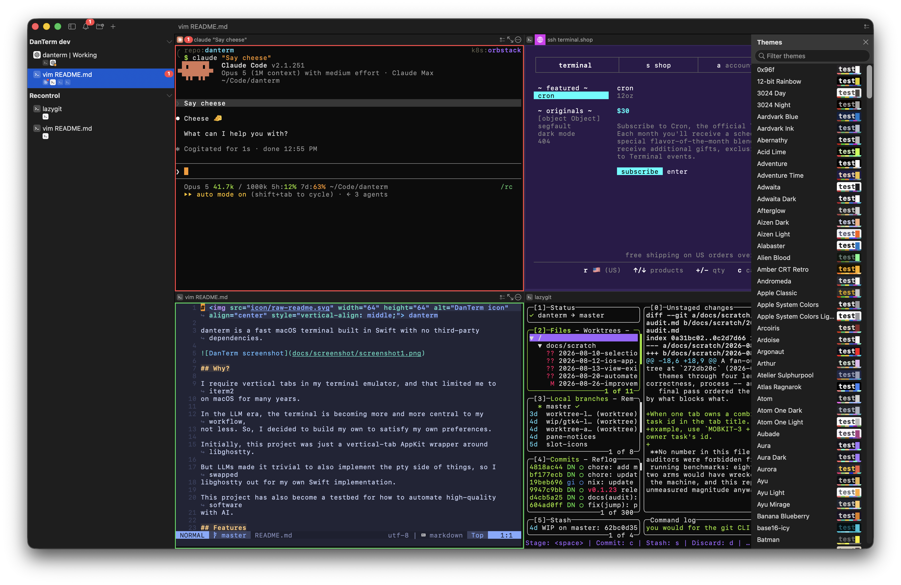

#  danterm

A macOS terminal built on ghostty with the behavior I want.


_Built-in theme browser sidebar (Cmd+Shift+B):_



## Install

Download the latest `.dmg` from [Releases](https://github.com/danneu/danterm/releases/latest).

<details>
<summary>Nix (home-manager)</summary>

```nix
# flake.nix
{
  inputs = {
    nixpkgs.url = "github:NixOS/nixpkgs/nixpkgs-unstable";
    home-manager.url = "github:nix-community/home-manager";
    danterm.url = "github:danneu/danterm";
  };

  outputs = { nixpkgs, home-manager, danterm, ... }: {
    homeConfigurations."myuser" = home-manager.lib.homeManagerConfiguration {
      pkgs = nixpkgs.legacyPackages.aarch64-darwin;
      modules = [
        danterm.homeManagerModules.default
        {
          programs.danterm.enable = true;
        }
      ];
    };
  };
}
```

</details>

## Usage

Like any other terminal, you probably want to grant DanTerm.app these macOS permissions:

- Settings -> Privacy & Security -> Full Disk Access
- Settings -> Privacy & Security -> Developer Tools

## Configuration

DanTerm uses a config file at `~/.config/danterm/config` with the same `key = value`
format as Ghostty. Open it with **Cmd+,** from the menu bar.

This file is an **overlay** on top of Ghostty's own config (`~/.config/ghostty/config`).
You can put any Ghostty terminal setting in it (fonts, colors, cursor style, etc.) and
it will override the Ghostty config. You can also use DanTerm-specific keys listed below.

```
# Override Ghostty settings for DanTerm
font-size = 14
theme = Dracula

# DanTerm-specific settings
remote-theme = Purplepeter
```

Reload with **Cmd+Shift+,**. Open the underlying Ghostty config with **Cmd+Option+,**.

### DanTerm-specific keys

| Key                | Default       | Description                                                                        |
| ------------------ | ------------- | ---------------------------------------------------------------------------------- |
| `remote-theme`     | `Purplepeter` | Ghostty theme applied to panes during SSH/remote sessions                          |
| `alert-clear-mode` | `focus`       | When to clear pane alerts: `focus` (on pane focus) or `manual` (only via ⌘. / ⇧⌘.) |

Set `alert-clear-mode = manual` to make alerts persist until you explicitly dismiss them with ⌘. (all panes in tab) or ⇧⌘. (current pane only). This is useful when you want alerts to act as a to-do list — focusing a pane to check what triggered the alert won't clear it, so the badge stays visible as a reminder to come back to it.

## Non-negotiable features:

- Vertical tab sidebar
- Split panes
- Creating a tab/pane should use the cwd of the previous pane
- Highly visible terminal bell that remains until dismissed
- Notifications from panes toggle the originating pane when clicked

## Bonus features:

- Tabs can be grouped into collapsible sections
- Lightweight: Built with AppKit (Swift) on top of ghostty (zig)
- Theme browser sidebar lets you change the current pane's theme on the fly
- Remote session integration (ssh, mosh, etc)
  - Give remote sessions a custom theme
- Launch terminal with specific layout/tabs/panes/commands: `--init <model.json>`
- Dump and restore danterm state from a json file
- Restore danterm state if it detects non-graceful exit

## General terminal features

- Cmd-click to open URL and file paths
  - Cmd-shift-click needed if program is capturing mouse events (vim, tmux, etc). The shift modifier tells ghostty the click is for you, not the program.

## Claude Code Integration

Run `danterm doctor` to check the integration pieces DanTerm can validate from
the CLI: agent hook paths, agent skill discovery, the `danterm` executable on
PATH, the manual `.app` `/usr/local/bin/danterm` link when relevant, app
translocation, and `jq` on PATH. The command is local-only, so it works even
when the app is not running.

Claude Code's default notification path waits on a roughly 60-second idle
timer before emitting terminal notifications. DanTerm ships Claude Code hooks
that bypass that delay and emit immediate per-pane OSC 777 notifications when
Claude finishes a turn or needs user input.

The hook notifies for final top-level turns, suppresses subagent completion
noise, stays quiet when a top-level turn merely parks to wait on still-running
background work (background agents, workflows, or shells), and still alerts when
any agent is blocked on user input, including MCP elicitation dialogs.

### Requirements

Claude Code v2.1.141 or newer is required for hook
[`terminalSequence`](https://code.claude.com/docs/en/hooks#emit-terminal-notifications)
support.

### Prerequisite

Disable Claude Code's native notification channel so it does not duplicate the
DanTerm hook path. Claude Code documents
[`preferredNotifChannel`](https://code.claude.com/docs/en/settings) as the
notification setting; use either path:

- JSON: add `"preferredNotifChannel": "notifications_disabled"` to
  `~/.claude/settings.json` or the project-local equivalent.
- Interactive: open `/config` inside Claude Code and set Notifications to
  disabled.

Skipping this prerequisite leaves the delayed native notification path enabled,
so Claude Code can still emit late notifications from panes you have already
tabbed away from.

With Nix, add `danterm.overlays.default` to your `nixpkgs.overlays`, then point
Claude Code at the packaged hook:

```nix
command = "${pkgs.danterm-claude-notify-osc777}/bin/danterm-claude-notify-osc777";
```

For raw Claude Code JSON settings, use the bundled app hook path as the command:

```json
{
  "preferredNotifChannel": "notifications_disabled",
  "hooks": {
    "Stop": [
      {
        "hooks": [
          {
            "type": "command",
            "command": "/Applications/DanTerm.app/Contents/Resources/danterm-hooks/danterm-claude-notify-osc777",
            "timeout": 10
          }
        ]
      }
    ],
    "PreToolUse": [
      {
        "matcher": "AskUserQuestion",
        "hooks": [
          {
            "type": "command",
            "command": "/Applications/DanTerm.app/Contents/Resources/danterm-hooks/danterm-claude-notify-osc777",
            "timeout": 10
          }
        ]
      }
    ],
    "PermissionRequest": [
      {
        "hooks": [
          {
            "type": "command",
            "command": "/Applications/DanTerm.app/Contents/Resources/danterm-hooks/danterm-claude-notify-osc777",
            "timeout": 10
          }
        ]
      }
    ],
    "Elicitation": [
      {
        "hooks": [
          {
            "type": "command",
            "command": "/Applications/DanTerm.app/Contents/Resources/danterm-hooks/danterm-claude-notify-osc777",
            "timeout": 10
          }
        ]
      }
    ]
  }
}
```

For non-Nix installs, DanTerm ships the script inside the app at
`/Applications/DanTerm.app/Contents/Resources/danterm-hooks/danterm-claude-notify-osc777`
once DanTerm is installed in `/Applications`. That location matches the bundled
`danterm` CLI requirement: a translocated app cannot provide stable hook paths.
Ensure `jq` is installed on the PATH Claude Code uses for hooks. As a source or
dev-build fallback, copy
[`integrations/claude-code/claude-notify-osc777.sh`](integrations/claude-code/claude-notify-osc777.sh)
somewhere on your machine and point the command at that file.

DanTerm turns OSC 777 and OSC 9 messages into a macOS notification that, when
clicked, will take you to the originating pane.

The exact accepted notification forms, terminal identity, queries, terminfo
claims, denials, and resource limits are documented in the
[terminal capability contract](docs/terminal-capabilities.md), the normative
contract; `TERM=xterm-256color` is only its compatibility selector.

### Live agent notification compatibility tests

An opt-in macOS-oriented suite launches the installed, authenticated Claude and
Codex CLIs in fresh PTYs and isolated temporary configuration:

```sh
just test-agent-notifications-live          # both CLIs
just test-agent-notifications-live claude
just test-agent-notifications-live codex
```

The suite uses network access and model quota and is intentionally outside CI
and the normal `just test` gate. It requires the selected binaries on `PATH`, a
working login (`~/.codex/auth.json` for Codex), and `jq` for Claude's production
hook. Claude defaults to `haiku`; set `DANTERM_CLAUDE_MODEL` to override it.
Codex uses its configured default model unless `DANTERM_CODEX_MODEL` is set.
`DANTERM_AGENT_NOTIFICATION_TIMEOUT` changes the per-scenario timeout in
seconds. `DANTERM_AGENT_NOTIFICATION_GRACE` changes the post-event wait for a
terminal notification (5 seconds by default). Set
`DANTERM_KEEP_AGENT_NOTIFICATION_ARTIFACTS=1` to retain successful
captures, or `DANTERM_AGENT_NOTIFICATION_ARTIFACTS=/private/tmp` to choose the
temporary-artifact parent. Failures always preserve sanitized hook payloads and
raw PTY captures and print their location.

Claude is tested through DanTerm's production notification hook, which returns
OSC 777 via `terminalSequence`. Codex deliberately has no DanTerm notification
hook: the suite configures its native TUI path for `agent-turn-complete`,
`approval-requested`, and `plan-mode-prompt`, with OSC 9 and the condition set
to `always`. Every scenario runs in a fresh process so completion and blocked
input notifications cannot be confused with an earlier lifecycle event.

The equivalent Codex configuration is:

```toml
[tui]
notifications = ["agent-turn-complete", "approval-requested", "plan-mode-prompt"]
notification_method = "osc9"
notification_condition = "always"
```

The table below is both the notification policy and the latest live
compatibility result. "Pass" means the CLI produced exactly one terminal
notification at the required point; completion notifications are deliberately
deferred until the root turn genuinely finishes.

| Scenario | Required behavior | Claude 2.1.216: DanTerm hook (OSC 777) | Codex 0.144.6: native TUI (OSC 9) |
| --- | --- | --- | --- |
| Root completes | Notify once after root `Stop` | Pass | Pass |
| Root asks a direct question | Notify while blocked, before root `Stop` | Pass: `AskUserQuestion` | Pass: `plan-mode-prompt` |
| Root requests tool approval | Notify while blocked | Pass: `PermissionRequest` | Pass: `approval-requested` |
| Root receives MCP elicitation | Notify while the form is blocked | Pass: `Elicitation` | Pass: native approval dialog |
| Subagent completes | Stay silent for `SubagentStop`; notify once after later root completion | Pass | Pass |
| Subagent requests approval | Notify while the subagent is blocked | Pass: identified `PermissionRequest` | Known gap: dialog and identified event appear, but no OSC 9 |
| Subagent receives MCP elicitation | Notify while the subagent form is blocked | Pass: identified MCP call plus `Elicitation` | Known gap: dialog and identified events appear, but no OSC 9 |
| Root parks on background work | Stay silent while parked; notify after genuine root completion | Pass | Not covered; Claude-only compatibility case |

These results were captured by the live suite on July 21, 2026. Re-run it after
upgrading either CLI rather than treating the version-specific gaps as
permanent. The Codex root-question fixture enables
`features.default_mode_request_user_input` only in its isolated test config so
it can exercise the same `plan-mode-prompt` notification used by Plan mode.
The flag controls tool availability, not notification delivery, and is not
required in the notification configuration above.

### Claude session recovery hook

DanTerm can also show a per-pane Claude session indicator and persist a crash
recovery hint. Wire Claude Code's `SessionStart` hook to the packaged script:

```nix
command = "${pkgs.danterm-claude-agent-session}/bin/danterm-claude-agent-session";
timeout = 2;
```

For raw Claude Code JSON settings, point `SessionStart` at the bundled app hook
path:

```json
{
  "hooks": {
    "SessionStart": [
      {
        "hooks": [
          {
            "type": "command",
            "command": "/Applications/DanTerm.app/Contents/Resources/danterm-hooks/danterm-claude-agent-session",
            "timeout": 2
          }
        ]
      }
    ]
  }
}
```

For non-Nix installs, use the script shipped inside the app at
`/Applications/DanTerm.app/Contents/Resources/danterm-hooks/danterm-claude-agent-session`.
Ensure `jq` and `danterm` are installed on the PATH Claude Code uses for hooks.
As a source or dev-build fallback, copy
[`integrations/claude-code/danterm-agent-session.sh`](integrations/claude-code/danterm-agent-session.sh)
somewhere on your machine and point the command at that file.

### Codex session recovery hook

DanTerm can show the same per-pane session indicator and crash recovery hint for
Codex. Wire Codex's `SessionStart` hook to the packaged script:

```nix
command = "${pkgs.danterm-codex-agent-session}/bin/danterm-codex-agent-session";
timeout = 2;
```

For raw Codex JSON settings, point `SessionStart` at the bundled app hook path:

```json
{
  "hooks": {
    "SessionStart": [
      {
        "hooks": [
          {
            "type": "command",
            "command": "/Applications/DanTerm.app/Contents/Resources/danterm-hooks/danterm-codex-agent-session",
            "timeout": 2
          }
        ]
      }
    ]
  }
}
```

For non-Nix installs, use the script shipped inside the app at
`/Applications/DanTerm.app/Contents/Resources/danterm-hooks/danterm-codex-agent-session`.
Ensure `jq` and `danterm` are installed on the PATH Codex uses for hooks. As a
source or dev-build fallback, copy
[`integrations/codex/danterm-agent-session.sh`](integrations/codex/danterm-agent-session.sh)
somewhere on your machine and point the command at that file.

Codex fires `SessionStart` lazily on the first prompt submission, so the chip
appears after the first message rather than at launch. Codex has no session-end
hook; DanTerm clears the chip through its shell-integration process-end signal.
The hook is intentionally stdout-silent because Codex adds `SessionStart` stdout
as extra developer context. Codex may ask you to trust the hook once before it
runs.

## Agent Skill

DanTerm ships an [Agent Skill](https://code.claude.com/docs/en/skills) under
[`integrations/danterm/`](integrations/danterm). It teaches coding agents
(Claude Code, Codex, etc.) how to drive DanTerm from the shell: renaming the
current tab, opening a new tab and launching a command in it, reading another
pane's output, sending keys to another pane, theme switching, and todos.

Install the skill directory, not the loose file, into your agent runtime's
skill discovery path:

| Runtime | User-wide path | Per-project path |
|---|---|---|
| Claude Code | `~/.claude/skills/danterm` | `<repo>/.claude/skills/danterm` |
| Codex | `~/.codex/skills/danterm` | `<repo>/.codex/skills/danterm` |

### With Nix

Add `danterm.overlays.default` to your `nixpkgs.overlays`, then symlink the
packaged skill directory:

```nix
home.file.".claude/skills/danterm".source =
  "${pkgs.danterm-agent-skill}/share/danterm-agent-skill";
home.file.".codex/skills/danterm".source =
  "${pkgs.danterm-agent-skill}/share/danterm-agent-skill";
```

### Without Nix

Clone this repo or download the directory, then symlink:

```sh
mkdir -p ~/.claude/skills ~/.codex/skills
ln -s /absolute/path/to/danterm/integrations/danterm \
  ~/.claude/skills/danterm
ln -s /absolute/path/to/danterm/integrations/danterm \
  ~/.codex/skills/danterm
```

### Verify

- Claude Code: type `/skills` and confirm `danterm` is listed.
- Codex: type `/skills` in an interactive Codex session and confirm `danterm`
  is listed.

Restart Codex after installing so it reloads the skill list. For Claude Code,
open `/skills`; if `danterm` is not listed, restart the session.

## OpenAI Codex Integration

Codex already works out of the box.

## Shell Integration

DanTerm can export its state or load from a state file.

This state includes the tab groups, tabs, pane layout, cwd of each pane, and
(once you opt in) the command running in each pane.

Source the bundled integration for your shell to opt in. Use the matching line
in `~/.zshrc`, `~/.bashrc`, or `~/.config/fish/config.fish`:

```sh
source /Applications/DanTerm.app/Contents/Resources/shell-integration/danterm.zsh
source /Applications/DanTerm.app/Contents/Resources/shell-integration/danterm.bash
source /Applications/DanTerm.app/Contents/Resources/shell-integration/danterm.fish
```

Choose only the line for the shell loading that configuration file. The assets
are inert outside DanTerm and safe to source repeatedly. They preserve existing
prompt hooks, report command boundaries and local cwd without changing terminal
titles, and wrap SSH/mosh to preserve pane-scoped remote-session reporting.

For `user@host` labels, source the same bundled asset on the remote shell and ensure
the remote sshd accepts `LC_*` environment variables. In `sshd_config`, use:

```sshconfig
AcceptEnv LC_*
```

On NixOS, use:

```nix
services.openssh.settings.AcceptEnv = "LC_*";
```

`AcceptEnv LANG LC_*` is also fine if you want normal locale forwarding. DanTerm
only requires `LC_*`, because its ssh/mosh wrappers forward the integration
marker as `LC_DANTERM=1` with `SendEnv`. If the remote does not accept or source
the snippet, DanTerm still shows the compact remote accessory from the local
`remote-start` event, but the host label stays empty.

When changing the shell integrations, run:

```sh
bash scripts/tests/shell-integration_test.sh
```

## Keybinds

| Action                         | Shortcut |
| ------------------------------ | -------- |
| New Tab                        | ⌘T       |
| New Tab at End of Group        | ⇧⌘T      |
| Next Tab                       | ⇧⌘N      |
| Previous Tab                   | ⇧⌘P      |
| Close Pane                     | ⌘W       |
| Close Tab                      | ⇧⌘W      |
| Split Pane Right               | ⌘D       |
| Split Pane Down                | ⇧⌘D      |
| Focus Pane Left                | ⇧⌘H      |
| Focus Pane Down                | ⇧⌘J      |
| Focus Pane Up                  | ⇧⌘K      |
| Focus Pane Right               | ⇧⌘L      |
| Toggle Pane Zoom               | ⌘Enter   |
| Toggle Theme Browser           | ⇧⌘B      |
| New Group                      | ⌘N       |
| Next Unread Alert              | ⇧⌘A      |
| Clear Tab Alerts               | ⌘.       |
| Clear Pane Alerts              | ⇧⌘.      |
| Toggle Tab To-do List          | ⌘'       |
| Toggle Pane To-do List         | ⇧⌘'      |
| Open DanTerm Config            | ⌘,       |
| Open Ghostty Config            | ⌥⌘,      |
| Reload Config                  | ⇧⌘,      |
| Quit                           | ⌘Q       |

## Comparison

| Feature        | DanTerm | [cmux][cmux] | iTerm2 | Kitty |
| -------------- | ------- | ------------ | ------ | ----- |
| Vertical tabs  | Yes     | Yes          | Yes    | --    |
| Tab groups     | Yes     | Yes          | --     | --    |
| Fast           | Yes     | Yes          | --     | Yes   |
| No browser     | Yes     | --           | --     | Yes   |
| No nested tabs | Yes     | --           | Yes    | Yes   |
| \*To-do list   | Yes     | --           | --     | --    |
| Dan            | Yes     | --           | --     | --    |

[cmux]: https://github.com/manaflow-ai/cmux

\* = Experimental bloat / scope creep

As you can see, DanTerm is the clear winner.

### iTerm2

iTerm was my go-to macOS terminal for 10+ years, but I've been having enough random issues with it that I figured it would be less of a setback to build my own.

e.g. Copy (cmd-c) was unreliable and notifications never seemed to properly focus the originating pane when using the global hotkey window.

### Kitty/WezTerm

I tried these after iTerm, but they have really bad tab systems. I want something more first class and polished, like browser tabs.

### cmux

Cmux is a really good idea: https://github.com/manaflow-ai/cmux

But it's more complicated than I'd like since it includes a browser, and its panes can contain tabs.

## Tips

### Hold Shift to bypass terminal mouse capture\*\*

Many TUI programs — tmux, vim, less, htop, fzf, btop, ranger, k9s — turn on "mouse reporting" so they can handle clicks, drags, and scrolls themselves. The downside: your terminal stops doing native click-drag selection, so highlighting text to copy with ⌘C suddenly doesn't work. Either nothing gets selected, or the program highlights text into its own internal buffer that ⌘C can't reach.

Ghostty (and other modern terminals) reserve **Shift** as an override: hold it while click-dragging and the terminal ignores mouse reporting for that gesture and does its normal selection. Release, ⌘C, done.

Example — tmux: with `set -g mouse on`, a plain drag enters tmux's copy-mode and clears on release without touching the system clipboard. Shift+drag bypasses tmux entirely and gives you a normal terminal selection you can ⌘C.

Same trick works inside vim with `set mouse=a`, inside less, inside htop, etc.

## Development

The dev loop is to make changes and `just build-run` to try them out.

- `just build` or `bash ./dev-build.sh` to build a local dev app to
  ".build/DanTerm Dev.app" and copy to "~/Applications/DanTerm Dev.app".
- `just build-run` or `bash ./dev-build-run.sh` to build + run it.
- `just build-optimized` or `bash ./dev-build.sh --release` to build the same
  dev app with SwiftPM's release configuration.
- `just build-run-optimized` or `bash ./dev-build-run.sh --release` to build
  and run that optimized dev app.

The optimized commands retain the `DanTerm Dev.app` name, dev bundle ID,
development signing, install path, and selected terminal backend. They do not
create a production release or publish anything.

The `just preview-glyphs` sprite comparison requires
[`SymbolsNerdFontMono-Regular.ttf`](https://github.com/ryanoasis/nerd-fonts/releases/latest/download/NerdFontsSymbolsOnly.zip)
for its Powerline references and
[`unifont_upper-17.0.05.otf`](https://unifoundry.com/pub/unifont/unifont-17.0.05/font-builds/unifont_upper-17.0.05.otf)
for its Symbols for Legacy Computing references. Install both with Font Book
before launching the preview. The
[terminal sprite system](docs/terminal-sprites.md) documents the procedural
glyph contract, layer boundaries, family models, and extension rules.

I don't remember why, but there was some benefit to running the app from the macOS applications folder during dev.

I think so that it shows up in permissions lists in macOS settings.
