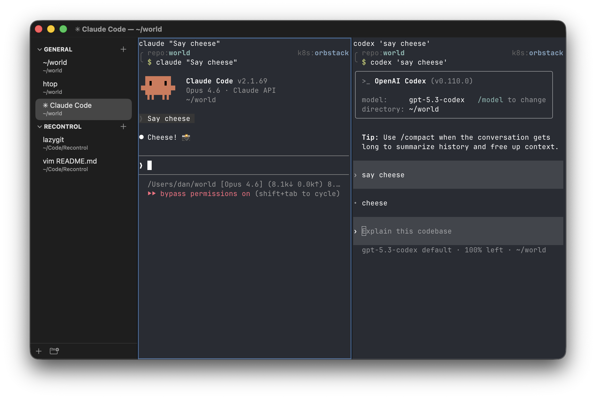

#  danterm

danterm is a fast macOS terminal built in Swift with no third-party dependencies.



## Why?

I like vertical tabs, which for years meant using iTerm2 on macOS.

In the LLM era the terminal is becoming more and more central to my workflow,
not less. So, I decided to build my own to satisfy my own preferences.

It runs on its own Swift terminal engine -- grid, parser, renderer, and pty, with no third-party dependencies. It started as an AppKit wrapper around libghostty, but LLMs made writing the engine itself tractable, and the project doubles as a testbed for automating high-quality software with AI.

## Ideals

- Everything should be both keyboard- and mouse-driven
- The terminal engine should be reusable outside of danterm, embeddable by other projects
- Cross-platform

## Features

- Vertical tabs
- Split panes that inherit the current working directory
- Persistent pane alerts and macOS notifications (click a notification to focus its pane)
- Local and remote color themes
- Save, restore, and crash-recover tabs, panes, and the commands running in them
- Semantic pane states ("idle", "running command (make test)", "running agent claude (busy)") reported by shell and agent integrations
- Full control via `danterm` command-line interface for scripts and coding agents
- Remote IPC over a Tailscale tailnet ([docs](docs/tailnet.md))
- Config file

## Install

Requires macOS 26 on Apple Silicon.

Download the latest `.dmg` from
[GitHub Releases](https://github.com/danneu/danterm/releases/latest), then move
DanTerm to `/Applications`. Releases are Developer ID signed and notarized, and
the whole app is an 8 MB download.

If your shell tools need them, grant DanTerm Full Disk Access and Developer
Tools in System Settings under Privacy & Security.

### Nix

Add the flake and Home Manager module:

```nix
{
  inputs = {
    nixpkgs.url = "github:NixOS/nixpkgs/nixpkgs-unstable";
    home-manager.url = "github:nix-community/home-manager";
    danterm.url = "github:danneu/danterm";
  };

  outputs = { nixpkgs, home-manager, danterm, ... }: {
    homeConfigurations.myuser = home-manager.lib.homeManagerConfiguration {
      pkgs = nixpkgs.legacyPackages.aarch64-darwin;
      modules = [
        danterm.homeManagerModules.default
        { programs.danterm.enable = true; }
      ];
    };
  };
}
```

## Configure

Press Cmd+, to edit `~/.config/danterm/config.json`, Cmd+Shift+, to reload it.
Every setting has a default, so a new config file holds only
`{"schemaVersion": 1}`.

| Key                       | Default                | Meaning                                                                                                                          |
| ------------------------- | ---------------------- | -------------------------------------------------------------------------------------------------------------------------------- |
| `font.family`             | system monospace       | Terminal font family. Omit the key to keep the system font.                                                                      |
| `font.size`               | `13`                   | Terminal font size, in points. Bounded to 8 through 72.                                                                          |
| `keyboard.optionAsAlt`    | native                 | Use `"left"`, `"right"`, or `"both"` to send that physical Option key as terminal Alt. Omit the key for native macOS text input. |
| `theme.default`           | `"Monokai Remastered"` | Theme for local panes.                                                                                                           |
| `theme.remote`            | `"Purplepeter"`        | Theme for panes in an SSH or other remote session.                                                                               |
| `shell.localeFallback`    | `true`                 | Give a local pane a UTF-8 `LANG` when it inherits none.                                                                          |
| `tailnet.listen`          | absent                 | Tailnet endpoint for remote IPC. See [docs/tailnet.md](docs/tailnet.md).                                                         |
| `tailnet.admittedNodeIds` | absent                 | Tailscale node ids allowed to use remote IPC. See [docs/tailnet.md](docs/tailnet.md).                                            |
| `tailnet.enable`          | `true`                 | Set to `false` to keep the tailnet settings on disk with the listener closed.                                                    |
| `ui.alertClearMode`       | `"focus"`              | `"focus"` clears pane alerts on focus, `"manual"` keeps them until you dismiss them.                                             |
| `ui.copyOnSelect`         | `true`                 | Copy a mouse selection to the clipboard when it finishes.                                                                        |

Nix users can keep the writable config in a dotfiles repository:

```nix
programs.danterm.configPath = "/Users/me/src/dotfiles/danterm/config.json";
```

## Shell integration

Shell integration lets DanTerm track working directories, commands, and remote
sessions. Home Manager: `programs.danterm.shellIntegration.enable = true;`.
Otherwise add the matching line to your shell config:

```sh
# ~/.zshrc
if [[ -n ${DANTERM_SHELL_INTEGRATION_DIR:-} ]]; then
  source "$DANTERM_SHELL_INTEGRATION_DIR/danterm.zsh"
fi

# ~/.bashrc
if [[ -n ${DANTERM_SHELL_INTEGRATION_DIR:-} ]]; then
  source "$DANTERM_SHELL_INTEGRATION_DIR/danterm.bash"
fi

# ~/.config/fish/config.fish
if set -q DANTERM_SHELL_INTEGRATION_DIR; and test -n "$DANTERM_SHELL_INTEGRATION_DIR"
  source "$DANTERM_SHELL_INTEGRATION_DIR/danterm.fish"
end
```

For remote labels, copy the integration to the host and source it from the
remote shell config (use `.bash` or `.fish` for those shells):

```sh
scp -r /Applications/DanTerm.app/Contents/Resources/shell-integration \
  user@host:~/.danterm-shell-integration

source ~/.danterm-shell-integration/danterm.zsh
```

```sshconfig
# /etc/ssh/sshd_config
AcceptEnv LC_*
```

Refresh the copied directory after upgrading DanTerm; DanTerm ignores identity
reports from older copies.

## Agent skill

DanTerm bundles a skill that teaches Claude Code and Codex to control tabs and
panes, read output, send keys, switch themes, and manage to-do items.

```sh
danterm doctor  # Check permissions, CLI, hooks, skills, jq, and configured font.
danterm skill   # Print the bundled agent instructions.
```

Skill install and notification hooks: [docs/agent-setup.md](docs/agent-setup.md).

## Shortcuts

| Action            | Shortcut          |
| ----------------- | ----------------- |
| New tab           | Cmd+T             |
| Close pane        | Cmd+W             |
| Close tab         | Cmd+Shift+W       |
| Split right       | Cmd+D             |
| Split down        | Cmd+Shift+D       |
| Focus panes       | Cmd+Shift+H/J/K/L |
| Zoom pane         | Cmd+Enter         |
| Theme browser     | Cmd+Shift+B       |
| Next alert        | Cmd+Shift+A       |
| Clear pane alerts | Cmd+Shift+.       |
| Preferences       | Cmd+,             |
| Reload config     | Cmd+Shift+,       |

The app menus list all shortcuts. Rebind them in Settings > Key Bindings or the
config file: [docs/keybindings.md](docs/keybindings.md).

## Command-line interface

```sh
danterm ls
danterm tab new --cmd 'just test'
danterm pane split -h
danterm pane read --pane "$DANTERM_PANE" --lines 50
```

See [`integrations/danterm/SKILL.md`](integrations/danterm/SKILL.md) for all
commands and examples, and the
[terminal capability contract](docs/terminal-capabilities.md) for terminal
behavior.

## Develop

```sh
bash ./dev-build.sh --no-install  # Build without replacing an installed app.
just provision-worktree           # Run once in a new Git worktree.
just launch-slot                  # Run an isolated development copy.
just test                         # Run the test suite.
```

## License

MIT
